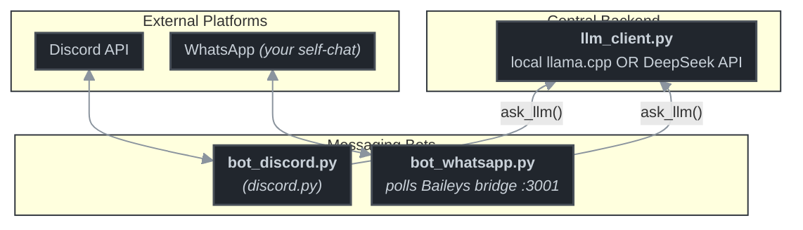

# DivaBot v1

A personal AI assistant that answers on **Discord** and **WhatsApp**, powered by
**DeepSeek's API** or a **local llama.cpp** server — same brain, every channel.



## Features

- **One shared LLM layer** (`llm_client.py`) with retries + exponential backoff,
  used by every frontend.
- **Two providers**, switched with `LLM_PROVIDER`:
  - `deepseek` — DeepSeek API (no GPU needed)
  - `local` — llama.cpp server on `http://localhost:8080` (fully offline)
- **Discord**: `!diva <question>` command + mention replies, with a gateway
  watchdog that prints actionable fixes (e.g. 4014 intent errors) instead of
  silently retrying.
- **WhatsApp**: runs its own [Baileys](https://github.com/WhiskeySockets/Baileys)
  bridge (separate session from any other tool, no public URL needed).
  Default `self-chat` mode: only **your** "Message yourself" chat is answered —
  stranger DMs are dropped.
- **No hardcoded secrets**: everything via environment variables (`.env`).

## Requirements

- Python ≥ 3.11 (`discord.py`, `requests`)
- Node.js ≥ 20 (for the WhatsApp Baileys bridge)
- Optional: [llama.cpp](https://github.com/ggml-org/llama.cpp) + a GGUF model
  for the local provider

## Quickstart

```bash
git clone https://github.com/paraguadiosa/DivaBot.git
cd DivaBot

python -m venv .venv
.venv/bin/pip install -e .          # or: .venv/bin/pip install -r requirements.txt
cp .env.example .env                # then edit: DEEPSEEK_API_KEY, DISCORD_TOKEN, ...

cd whatsapp_bridge && npm install && cd ..
```

### Discord

```bash
.venv/bin/python bot_discord.py
```

Set up the bot application at [discord.com/developers](https://discord.com/developers/applications):
Bot → **Message Content Intent** enabled → invite with the URL printed at startup.
Then use `!diva <question>` or mention the bot.

### WhatsApp

```bash
./scripts/run_whatsapp_bridge.sh     # 1st run: scan the QR (WhatsApp → Linked devices)
.venv/bin/python bot_whatsapp.py     # 2nd terminal
```

Message yourself in WhatsApp ("Message yourself" chat) — Diva replies there.

### Local LLM (optional, no internet)

```bash
MODEL_PATH=~/models/your-model.gguf ./scripts/run_llama_server.sh
LLM_PROVIDER=local .venv/bin/python bot_discord.py
```

### CLI smoke test

```bash
.venv/bin/python scripts/llm_cli.py "hello diva"
```

## Configuration

All settings come from environment variables (auto-loaded from `.env` or the
shared `~/.hermes/.env`). See [`.env.example`](.env.example) for the full list:

| Variable | Default | Description |
|---|---|---|
| `LLM_PROVIDER` | `local` | `local` (llama.cpp) or `deepseek` |
| `DEEPSEEK_API_KEY` | — | Required for the DeepSeek provider |
| `DEEPSEEK_MODEL` | `deepseek-chat` | DeepSeek model name |
| `LLAMA_API_URL` | `http://localhost:8080/v1` | Local llama.cpp base URL |
| `LLAMA_MODEL` | `llama-3-8b` | Model name reported to llama.cpp |
| `LLM_MAX_TOKENS` / `LLM_TEMPERATURE` / `LLM_TIMEOUT` / `LLM_MAX_RETRIES` | 512 / 0.7 / 120 / 2 | LLM tuning |
| `DISCORD_TOKEN` | — | Discord bot token |
| `WHATSAPP_BRIDGE_URL` | `http://127.0.0.1:3001` | Local Baileys bridge |
| `WHATSAPP_ALLOWED_USERS` | — | Comma-separated numbers (defense in depth) |

## Project layout

```
├── bot_discord.py            Discord frontend
├── bot_whatsapp.py           WhatsApp frontend (Baileys bridge client)
├── llm_client.py             shared LLM layer (providers, retries)
├── scripts/
│   ├── run_llama_server.sh   starts llama.cpp
│   ├── run_whatsapp_bridge.sh starts the Baileys bridge (QR pairing)
│   └── llm_cli.py            terminal smoke-test client
├── configs/llama_config.json llama.cpp defaults
├── whatsapp_bridge/          vendored Baileys HTTP bridge (Node)
└── tests/                    pytest unit tests
```

## Development

```bash
.venv/bin/pip install -e ".[dev]"
.venv/bin/pytest                      # Python unit tests
cd whatsapp_bridge && npm test        # bridge unit tests (node --test)
```

CI (GitHub Actions) runs both test suites on every push.

## Roadmap

- [x] DeepSeek + local llama.cpp providers
- [x] Discord bot (verified live)
- [x] WhatsApp bot (self-chat mode, verified live)
- [ ] WhatsApp group mode / media replies
- [ ] WhatsApp → Discord message relay
- [ ] systemd units for always-on bots

## License

[MIT](LICENSE)
